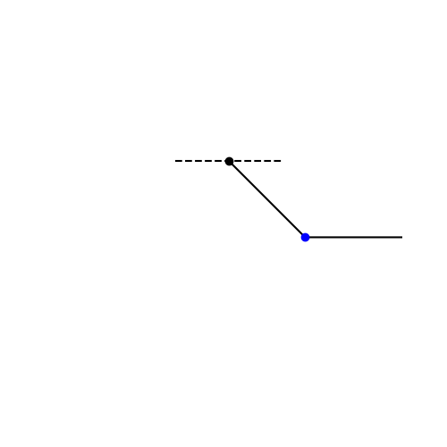
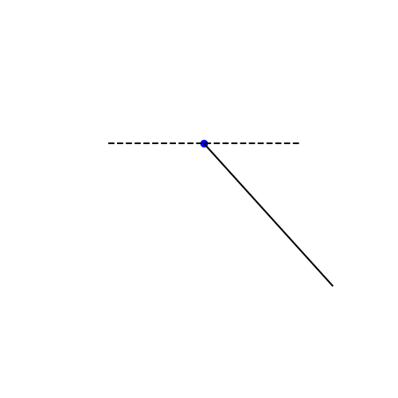
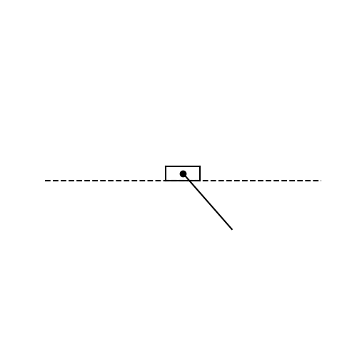
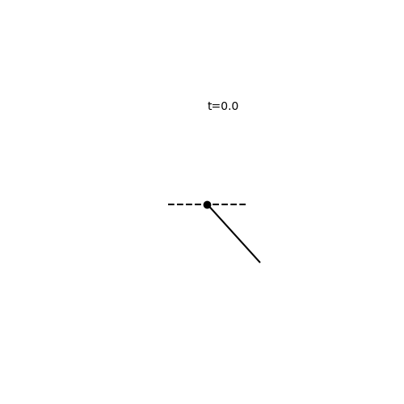
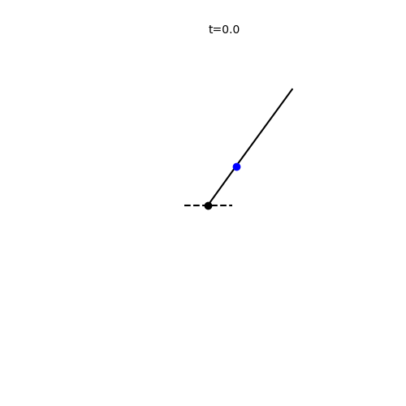
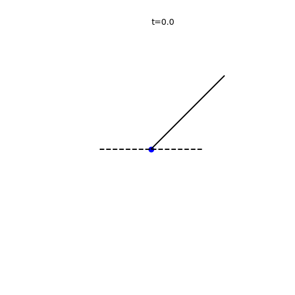
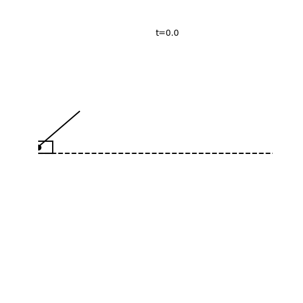

# Underactuated Robotics

Python implementations of Control and Optimization algorithms 
for simulated underactuated systems and walking robots

Inspired by the MIT's course [6.832 - Underactuated Robotics](http://underactuated.mit.edu/underactuated.html) 
of [Russ Tedrake](http://groups.csail.mit.edu/locomotion/russt.html).
The corresponding [edX course](https://courses.edx.org/courses/course-v1:MITx+6.832x_2+3T2015/course/) as well as the course notes largely assisted in studying the mathematical background of the showcased
algorithms.

## Implementations

## Rigid-Body Dynamical Systems

For benchmarking and simulation purposes, some well-known 
low-dimensional systems (frequently used in the literature) are
implemented. Both fully-actuated and underactuated versions
are tested.

<table>
  <th>Acrobot</th>
  <th></th>
  <th>Simple Pendulum</th>
  <th></th>
  <th>Cart-Pole</th>
  <tr>
    <td></td>
    <td></td>
    <td></td>
    <td></td>
    <td></td>
  </tr>
  
  <th>Rimless Wheel</th>
  <tr>
    <td></td>
  </tr>
</table>

## Fully-actuated systems
#### Feedback Linearization

Fully-actuated control becomes trivial when using feedback linearization
by cancelling-out the complex dynamics of the system and converting it
to a linear system (feedback equivalent).

For a second-order control-affine system

  

the feedback control 

makes the system equivalent to  allowing 
us to plug-in a simple PD controller with pole placement and transition the system
to the desired state. 

Swing-up control for pendulum and acrobot:

<table>
  <tr>
    <td></td>
    <td></td>
    <td></td>
    <td></td>
    <td></td>
  </tr>
</table>

## Underactuated systems
#### LQR Stabilization with Linearized Dynamics

Stabilize a non-linear system around a fixed point by applying a Linear Quadratic Regulator (LQR)
on a linearized version of the system. The system's initial state needs to be in the region of 
attraction of the fixed point.

LQR is a feedback controller derived from Dynamic Programming for linear systems and quadratic cost
on state and control signal.  

<table>
  <tr>
    <td></td>
    <td></td>
    <td></td>
    <td></td>
    <td></td>
  </tr>
</table>

#### Energy Shaping
*TODO*

## Walking systems
#### Rimless Wheel

The simplest model of legged robot. Assumes there will always 
be a swing leg in position at the time of collision. It uses pendula
for legs and moves only thanks to the gravity. With appropriate 
initial leg angle and angular velocity the wheel reaches periodic
stability (limit cycle) and walks down the slope.

The foot standing on the ground is modeled with a simple pendulum (`systems/pendulum.py`)
with initial angle near the upward position. Using the simple
collision detection logic that the pendulum's angle (from the upward position)
is 
the pendulum's position is changed during the simulation and is
placed in the position of next leg to hit the ground.
